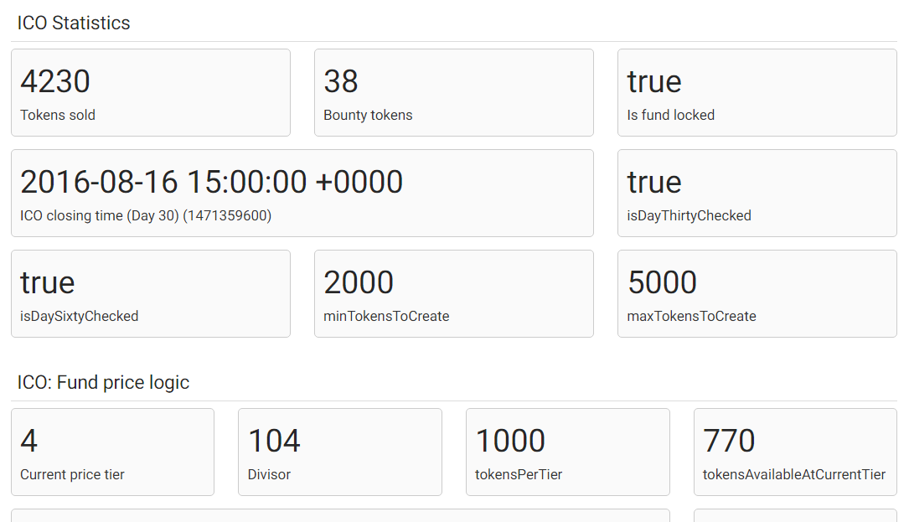

HONG Contract Explorer
================

## Live Version

The source code is running here: http://107.178.211.223:5100/. Select a contract there to continue.

## Screenshots

### Contract summary

### Contract details

## Software requirement

### NodeJS
- Check package.json for details: execute `npm install`

### Geth
- This program requires existence of `geth`.
- To start geth, execute `sudo geth --rpc console`

### MySQL
- You will need a MySQL instance running to save log data. Copy the file `config.json.tmpl` as `config.json`, and fill in access info to your MySQL server.
- Check `schema.sql` for database schema.

## Run the server

1. Deploy a contract with Mist Testnet.

2. Start server with `nodejs HongExplorer.js`. The server will be up at http://localhost:5100. Add a new contract if there is no records in the database.

3. Submit the form. Contract info will be saved.

4. Select the contract from the drop down menu of http://localhost:5100/ to explore the contract.
